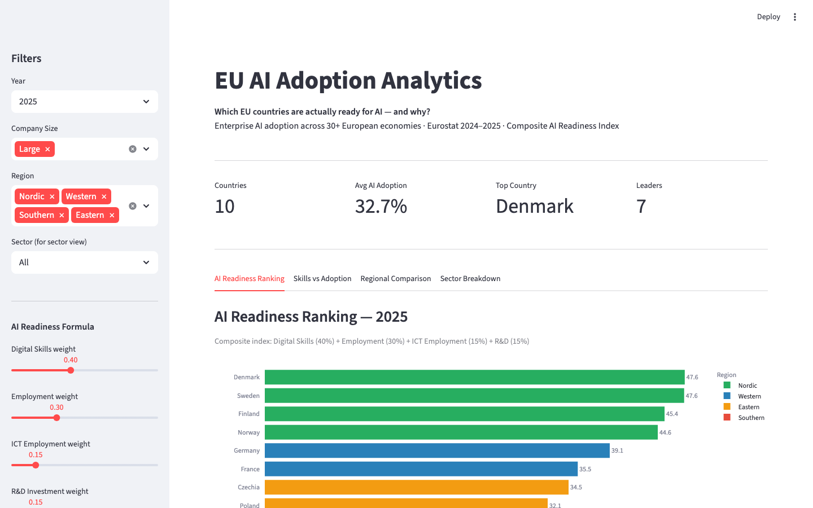
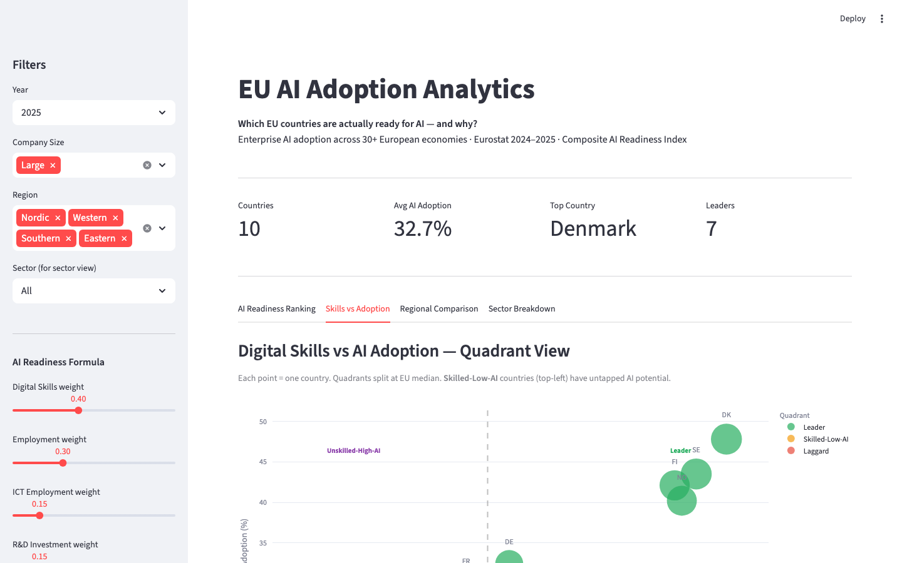
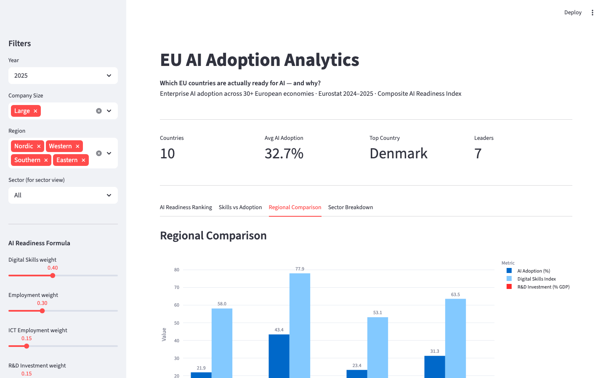
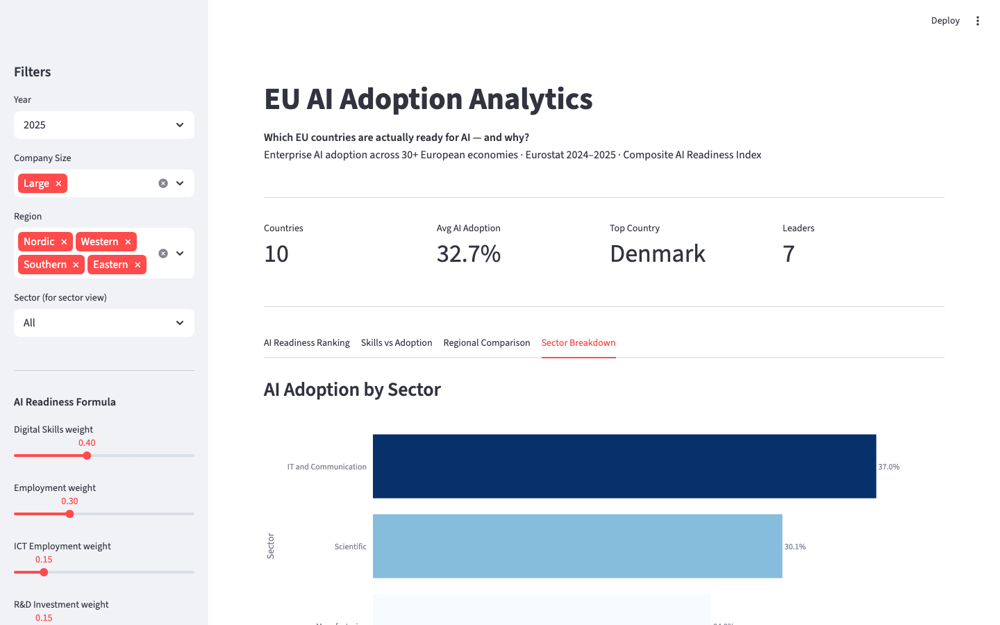

# EU AI Adoption Analytics


> **Which EU countries are actually ready for AI — and why?** A data-driven analysis of enterprise AI adoption across 30+ European economies using official Eurostat data (2024–2025), with a composite AI Readiness Index and interactive Tableau dashboards.

**[Live Demo (Streamlit)](https://your-app.streamlit.app)** &nbsp;|&nbsp; **[Tableau Dashboard (Public)](https://public.tableau.com/your-link)**

---

## The Question

AI adoption rates in Europe range from **47%** (Denmark) to **8%** (Romania) — a 6× gap. Is this about technology investment? Unemployment? Education? Or something else?

This project builds a **composite AI Readiness Index** from four Eurostat-sourced structural factors and tests six hypotheses about what actually drives enterprise AI adoption across Europe.

---

## Screenshots

### AI Readiness Ranking


*Country ranking by composite AI Readiness Index. Nordic countries lead; Eastern and Southern Europe lag. Germany ranks 6th — strong on R&D and employment, weaker on digital skills adoption.*

### Digital Divide Quadrant


*Skills vs Adoption scatter: Leaders (top-right) vs Laggards (bottom-left). Poland sits in the Skilled-Low-AI quadrant — high digital skills but low AI adoption — suggesting a policy opportunity.*

### Regional North–South Gap


*Nordic average AI adoption is 2.3× higher than Southern Europe. The gap is not explained by GDP alone — digital skills and R&D investment are the stronger predictors.*

### Company Size Effect


*Large enterprises adopt AI at 2–3× the rate of SMEs across all regions. The gap widens in Southern and Eastern Europe where SME support infrastructure is weaker.*

### Tableau Dashboard (Full)


*Interactive Tableau dashboard with LOD expressions: drill from regional view → country → sector → company size. Composite index calculated natively in Tableau.*

### Live Streamlit Demo


*Interactive explorer: filter by region, company size, and sector. Composite index formula is shown and adjustable.*

---

## Key Findings

| Hypothesis | Result |
|-----------|--------|
| H1: Lower unemployment → higher AI adoption | **Confirmed** — negative correlation, R² > 0.80 |
| H2: Higher digital skills → higher AI adoption | **Confirmed** — positive correlation across all regions |
| H3: Labour market + skills explain regional gaps | **Confirmed** — clear North–South and East–West divide |
| H4: Nordic / Western countries lead | **Confirmed** — Denmark, Finland, Sweden, Norway in top 5 |
| H5: Large enterprises adopt more than SMEs | **Confirmed** — gap widens with company size |
| H6: Technology sectors lead adoption | **Confirmed** — IT/ICT and Scientific sectors highest |

**Composite AI Readiness Index (weighted):**
```
AI_Readiness = (Digital_Skills × 0.40)
             + (1/Unemployment × 0.30)
             + (ICT_Employment × 0.15)
             + (R&D_pct_GDP   × 0.15)
```
No single factor alone explains adoption — structural readiness requires all four dimensions.

---

## Dataset

| Attribute | Detail |
|-----------|--------|
| Source | Eurostat (`isoc_eb_ai`, `isoc_eb_ain2`) + OECD + Oxford Insights |
| Coverage | 27 EU countries + Norway, Turkey, Western Balkans |
| Period | 2024–2025 |
| Records | 5,039 rows · 22 columns |
| Granularity | Country × Year × Company Size × Sector |

Sample data in `data/sample_processed.csv` — full dataset reproducible via `src/data_preparation.py`.

---

## Project Structure

```
eu-ai-adoption-analytics/
├── app.py                              ← Streamlit live demo
├── data/
│   ├── data_dictionary.md             ← Full column descriptions
│   └── sample_processed.csv           ← 50-row sample (runs without Eurostat download)
├── notebooks/
│   └── ai_adoption_analysis.ipynb    ← Full EDA + composite index
├── src/
│   ├── data_preparation.py           ← Load, clean, merge Eurostat sources
│   ├── composite_scores.py           ← AI Readiness Index + quadrant logic
│   └── visualizations.py             ← Matplotlib/Seaborn replication charts
├── screenshots/
│   └── GUIDE.md
├── tableau/
│   └── calculated_fields.md          ← All Tableau LOD expressions documented
├── requirements.txt
└── README.md
```

---

## Methods

| Task | Tool |
|------|------|
| Data cleaning & merging | Python (pandas) |
| Exploratory analysis | Matplotlib, Seaborn, SciPy |
| Correlation analysis | Pearson r, Spearman ρ |
| Interactive dashboards | Tableau Desktop |
| Advanced Tableau | LOD expressions, reference lines, composite calculated fields |
| Live demo | Streamlit |

---

## Setup

### Live Demo (no Eurostat download needed)
```bash
pip install -r requirements.txt
streamlit run app.py
```

### Full Reproduction
```bash
pip install -r requirements.txt

# Step 1: prepare data (downloads from Eurostat)
python src/data_preparation.py

# Step 2: compute composite scores
python src/composite_scores.py

# Step 3: generate static charts
python src/visualizations.py

# Or run the full notebook
jupyter lab notebooks/ai_adoption_analysis.ipynb
```

**Tableau workbook:** connect to `data/final_dataset.csv`; see `tableau/calculated_fields.md` for all LOD expressions.
